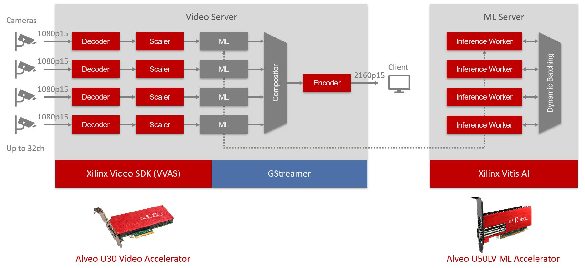
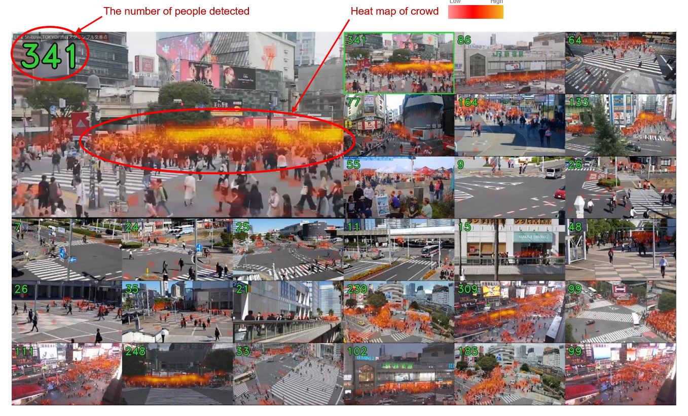

# Video analytics demo using Alveo U30 and U50LV/U55C

This demo shows
- Simultaneous 32-ch 1080p15 low latency video decoding using U30
- Real time crowd counting and object detection AI inference using U50LV/U55C

with low CPU usage.

## Demo overview



## Crowd counting demo example



## System architecture


## Prerequisites

- Host server that supports PCIe bifurcation x4x4
- Alveo U30
- Alveo U50LV or U55C
- Ubuntu 20.04

## Installation

Please see [INSTALL.md](INSTALL.md) for installation.

## Build or pull Docker image

```bash
$ ./docker/build.sh

or

$ docker pull anjn/alveo-video-analytics-demo:u30-u5x
```

## Prepare videos

Use `videos/transcode.sh` to transcode video clips into a suitable foramt for RTSP streaming. To use this script, `ffmpeg` needs to be installed.

```bash
./videos/transcode.sh VIDEO_CLIP
```

Video clips in `videos` directory will be streamed at `rtsp://YOUR_SERVER_IP:8554/testNN` by rtsp-simple-server. `NN` is the hexadecimal number starting from zero of the video clip ordered by its filename.

## Edit config.toml

### Add cameras

Modify camera list in `config.toml` according to your prepared video clips or live cameras. You can choose an AI model from `bcc` (crowd counting model) or `yolov3` (object detection model) for each camera. `RTSP_SERVER_IP` in `config.toml` will be automatically replaced with the actual docker container's IP at runtime. `id` is used for pushing result to time-series database and should be non-empty identical string assigned for each camera.

```toml
[video]
cameras = [
    # YOLOv3 person detection
    { id = "00, location = "rtsp://RTSP_SERVER_IP:8554/test00", model = "yolov3", labels = [ 14 ] },
    # YOLOv3 bicyle/bus/car/motorbike detection
    { id = "01, location = "rtsp://RTSP_SERVER_IP:8554/test01", model = "yolov3", labels = [ 1, 5, 6, 13 ] },
    # Crowd counting
    { id = "02, location = "rtsp://RTSP_SERVER_IP:8554/test02", model = "bcc" },
```

## Run demo

```bash
$ ./start.sh
```

This demo uses [rtsp-simple-server](https://github.com/aler9/rtsp-simple-server) for streaming output. You can see the video in the following ways.

- Open RTSP (`rtsp://YOUR_SERVER_IP:8554/test`) using VLC.
- Open HLS (`http://YOUR_SERVER_IP:8888/test`) using web browser.
- Open WebRTC (`http://YOUR_SERVER_IP:8889/test`) using web browser.

## Stop demo

```bash
$ ./stop.sh
```

## Third party software
- https://github.com/aler9/rtsp-simple-server
- https://github.com/zeromq/libzmq
- https://github.com/zeromq/cppzmq
- https://github.com/msgpack/msgpack-c
- https://github.com/ToruNiina/toml11
- https://github.com/gabime/spdlog
- https://github.com/anjn/arg
- https://github.com/TheYonkk/influxdb-cpp-2

